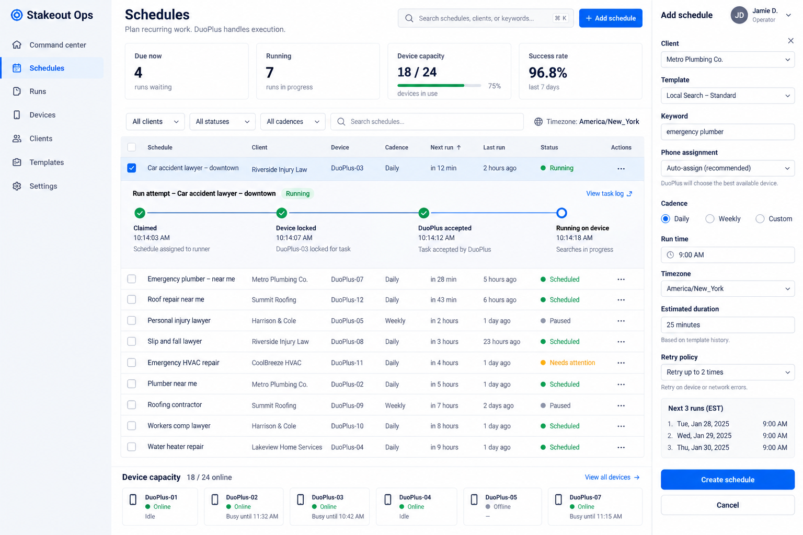

# Stakeout Ops

**September 15 Railway setup:** start with [SETUP.md](SETUP.md). This copy includes four-phase programs, shared capacity migrations, and a continuous Railway worker. See [deployment status](docs/deployment-status.md) for configured resources and launch requirements. The new worker has not run live devices.

Stakeout Ops is a multi-tenant scheduler and live operations board for DuoPlus RPA. Each person signs into a private workspace, connects **their own** DuoPlus API key, syncs their phones and templates, and schedules recurring work. Supabase owns the durable calendar and run history; DuoPlus remains the worker that executes each RPA graph.



## What it does

- Invitation-only private workspaces for you and your friends through Supabase Auth (public signup UI is closed by default)
- Bring-your-own DuoPlus API key; one account never shares another account's phones, templates, or runs
- Phone and custom-template discovery from DuoPlus—no hand-entered IDs
- Daily, weekly, or cron-based schedules with an explicit IANA timezone
- Durable schedules, run attempts, events, screenshots, and error logs
- Device leases so two runs cannot claim the same phone
- A shared per-connection rate gate that spaces DuoPlus calls by at least 1.2 seconds
- Power-on polling, optional GPS/locale updates, task submission, ID correlation, status sync, cancellation, retry, and task-log collection
- Command Center with live operations, attention queue, configured device-target map, capacity, workload, and recent proof
- Exact DuoPlus Subscription Startup discovery with a database-enforced power-on ceiling that prevents accidental Temporary Startup use
- Scheduler-owned phone power sessions with a 15-minute idle shutdown guard; phones already on before a run are never automatically powered off
- Versioned 15–30 day device cycles with five daily tasks, one-time day windows, and durable rollover history
- Profile readiness for each phone/account: per-app rule points, immutable success credits, configurable Ready/Completed gates, successful-day coverage, and no double-credit on retries
- Sanitized DuoPlus action evidence (for example `OPEN_APP` and `CLICK_ELEMENT`) with successful/failed totals; nested account, selector, content, credential, and request data is discarded and action counts never add readiness points
- Failure-only Android UI hierarchy capture through DuoPlus cloud-phone commands as bounded, redacted selector evidence; diagnostics never earn readiness points
- Production v1 assumes each phone arrives with its dedicated proxy already configured; Stakeout Ops does not create, rotate, replace, verify, or health-check that proxy
- Pause/resume, remove, and **Run now** controls

The RPA graph itself still lives in DuoPlus. Removing a schedule disables future materialization and cancels only DuoPlus tasks that are still cancellable; historical runs remain as an audit trail.

Readiness is an internal **Stakeout Readiness Score**, not a claim about Google trust, ranking eligibility, or account quality. A cycle rule receives its configured points only after DuoPlus reports that run succeeded. Failed, cancelled, retried, and diagnostic-only actions do not create additional points.

## Stack

- Next.js 16 / React 19
- Vercel dashboard and authenticated API routes
- Continuous Node.js scheduler on Railway
- Supabase Postgres, Auth, Row Level Security, and RPC-based leases
- DuoPlus OpenAPI (`POST` + JSON + `DuoPlus-API-Key`)

See [Architecture](docs/architecture.md) for the data and dispatch model and [Deployment](docs/deployment.md) for the complete production setup.

## Local setup

Requirements: Node.js 22 or newer, npm, and a Supabase project. The pinned `@supabase/supabase-js` 2.115.0 package declares Node 22 as its runtime floor.

```bash
npm install
cp .env.example .env.local
```

Create a 32-byte encryption key and a separate cron secret:

```bash
openssl rand -base64 32
openssl rand -hex 32
```

Place the first output in `INTEGRATION_ENCRYPTION_KEY` and the second in `CRON_SECRET`. Fill in the Supabase URL and publishable/secret keys in `.env.local`, then apply the migration under `supabase/migrations/` to your project. On a fresh project it bootstraps the tenancy tables; on an existing project it preserves compatible tenancy tables and adds the scheduler schema. Review it in either case, then use the Dashboard SQL Editor or link the CLI project and run `npx supabase db push`. The migration must be applied before the first authenticated request can create a personal workspace.

Start the app:

```bash
npm run dev
```

Open `http://localhost:3000` for local development. The live scheduler uses the `supabase-amber-ferry` project (`clolvodtfzeprpktdmzc`). Set **Supabase → Authentication → URL Configuration → Site URL** to `https://scheduler-dashboard-production.up.railway.app` and add these Redirect URLs:

```text
https://scheduler-dashboard-production.up.railway.app/auth/callback
https://scheduler-dashboard-production.up.railway.app/auth/callback?next=**
```

The second entry allows the callback's `next` query parameter; the app accepts only same-site destinations. Add localhost or an exact preview callback only if that deployment needs live authentication. For public signup, enable **Allow new users to sign up** in Supabase and set `NEXT_PUBLIC_ALLOW_SIGNUPS=true` in Railway. Keep `{{ .ConfirmationURL }}` as the action link in the Confirm signup, Invite user, and Magic link email templates. The backend URL (`NEXT_PUBLIC_SUPABASE_URL`) stays `https://clolvodtfzeprpktdmzc.supabase.co`; it is different from the dashboard Site URL. The callback uses a relative redirect so Railway's internal hostname cannot become the browser destination.

Supabase's built-in mailer is development-only and heavily restricted. Configure a custom SMTP provider under **Authentication → SMTP Settings** before relying on invitations or magic links in production; otherwise a successful Auth response does not guarantee prompt inbox delivery.

### Preview without Supabase

Leave the Supabase variables empty and explicitly set `NEXT_PUBLIC_DEMO_MODE=true` to render the read-only product preview. Demo mode does not persist data, verify API keys, or call DuoPlus. Missing configuration never enables demo mode implicitly; live deployments fail closed instead.

## Environment variables

| Variable | Required | Exposure | Purpose |
|---|---:|---|---|
| `NEXT_PUBLIC_SUPABASE_URL` | Production | Browser + server | Supabase project URL |
| `NEXT_PUBLIC_SUPABASE_PUBLISHABLE_KEY` | Production | Browser + server | Supabase publishable key; RLS still applies |
| `SUPABASE_SECRET_KEY` | Production | Server only | Privileged scheduler/API access; never prefix with `NEXT_PUBLIC_` |
| `INTEGRATION_ENCRYPTION_KEY` | Production | Server only | Base64-encoded 32-byte AES-256 key used to encrypt every BYO DuoPlus key |
| `PROXY_SELLER_AUTOMATION_ENABLED` | No | Server only | Future managed-proxy opt-in only; leave unset or `false` for production v1 |
| `PROXY_SELLER_API_KEY` | No | Server only | Future managed-proxy credential; required only when `PROXY_SELLER_AUTOMATION_ENABLED=true`, and never required to launch production v1 |
| `CRON_SECRET` | Scheduler | Server only | Bearer token accepted by scheduler endpoints |
| `DUOPLUS_BASE_URL` | No | Server only | Defaults to `https://openapi.duoplus.net` |
| `DUOPLUS_MIN_GAP_MS` | No | Server only | Per-connection request gap; defaults to `1200` |
| `DUOPLUS_ISSUE_TIMEZONE` | No | Server only | Valid IANA timezone persisted for new connections when formatting `issue_at`; defaults to `UTC` |
| `DISPATCH_LOOKAHEAD_MINUTES` | No | Server only | Near-term claim horizon for minute-tick mode |
| `DISPATCH_BATCH_SIZE` | No | Server only | Maximum runs claimed by a minute tick; defaults to `20` |
| `HORIZON_DISPATCH_BATCH_SIZE` | No | Server only | Maximum runs claimed by the daily horizon tick; defaults to `100` |
| `NEXT_PUBLIC_APP_URL` | Recommended | Browser + server | Canonical deployed origin; Production is `https://scheduler-dashboard-production.up.railway.app` |
| `NEXT_PUBLIC_ALLOW_SIGNUPS` | No | Browser + server | Defaults closed; only the exact value `true` exposes public account creation |
| `NEXT_PUBLIC_DEMO_MODE` | No | Browser + server | Read-only preview only when Supabase server config is absent |

Do not commit `.env.local`. Do not place a DuoPlus API key in any Vercel environment variable: every user enters their own key after signing in, and it is encrypted in Supabase.

Production v1 uses the proxy already configured on each phone. Leave `PROXY_SELLER_AUTOMATION_ENABLED` unset or `false` and leave `PROXY_SELLER_API_KEY` unset; device-cycle activation must not call Proxy-Seller or change, verify, or health-check the phone's proxy. The map plots the cycle's configured target location, not observed proxy GEO or proof of the exit IP.

Proxy-Seller integration code is retained for a future managed mode, but it is dormant by default and requires both the exact opt-in `PROXY_SELLER_AUTOMATION_ENABLED=true` and a server-only `PROXY_SELLER_API_KEY`. A key exposed in chat, a ticket, or a command line must be rotated before any future use. Because the provider embeds that key in request URLs, never log complete provider URLs or return proxy credentials to the browser.

Each workspace should connect a distinct DuoPlus account. Rate reservations are isolated by Stakeout connection; reusing one upstream API key across multiple workspaces would create independent gates that can collectively exceed DuoPlus's account limit.

## Use an existing Supabase project

1. Back up the database and review the SQL migration.
2. Apply every file in `supabase/migrations/` in filename order. With a linked CLI project, use `npx supabase db push`; otherwise paste the migration into the Dashboard SQL Editor.
3. Confirm email/password auth is enabled. For production, disable **Allow new users to sign up** in Supabase Auth and leave `NEXT_PUBLIC_ALLOW_SIGNUPS=false` (or unset) in Vercel. Invite each approved friend from Supabase instead.
4. Set the Site URL and Redirect URLs shown above. Confirm that Auth emails use `{{ .ConfirmationURL }}` rather than a hard-coded localhost or `{{ .SiteURL }}` action.
5. Configure custom SMTP for reliable invitation, confirmation, and magic-link delivery; the built-in mailer is intended only for development.
6. Verify Row Level Security is enabled on all Stakeout Ops tables and that a signed-in user cannot select another workspace's rows.
7. Keep `SUPABASE_SECRET_KEY` only in local server secrets and Vercel. It bypasses RLS and must never reach the browser.

The migration does not replace existing tenancy tables. It bootstraps `organizations`, `organization_members`, and `clients` only when all three are absent; a partial or incompatible existing base schema stops the migration. Stakeout Ops then adds the `duo_*` and `scheduler_*` tables plus narrowly scoped RPCs for run claims, device leases, and DuoPlus rate slots.

## First user / BYO DuoPlus onboarding

1. In DuoPlus, open **Console → Automation → API** and copy the API key.
2. Accept the Supabase invitation and sign in. The first authenticated request creates a private personal workspace.
3. Open setup, paste the DuoPlus key, and select **Connect**. The browser sends it only to an authenticated server route; the server verifies and encrypts it before storage.
4. Select **Sync inventory** to import every paginated phone plus both custom and official templates, and the current non-expired Subscription Startup count. Official and custom ids remain source-qualified, so the same DuoPlus id can safely exist in both catalogs. Dispatch remains fail-closed for new power-ons until that capacity count is known.
5. Create a client, then create a schedule with a template, keyword, cadence, timezone, expected duration, and either an assigned phone or auto-assignment.
6. Use **Run now** for the first real run. Expand the run attempt to follow claim, device lock, DuoPlus acceptance, execution, and collected logs/screenshots.

If DuoPlus returns code `401`, reconnect with a current key. The scheduler will not retry a rejected credential.

Before enabling real cadences, complete the two-minute timestamp probe in [Deployment](docs/deployment.md). DuoPlus sends `issue_at` without an offset; Stakeout Ops defaults the connection adapter to UTC, and the actual DuoPlus console time must confirm that assumption. The connection's serialization timezone and the schedule's business timezone are intentionally separate.

## Scheduling modes

The checked-in configuration uses one continuous Railway worker:

| Work | Cadence | Purpose |
| --- | --- | --- |
| Near-term tick | Sequential loop targeting every 30 seconds | Dispatch, status reconciliation, and slot handoff |
| Daily horizon | Startup and first iteration after 05:00 UTC | Materialize the next 26 hours and prune history |

`vercel.json` has no automatic cron jobs. The worker invokes the scheduler directly, using the existing database claims, shared physical Startup limits, and phone power-off guards. Deploy it with sleeping disabled and one replica. See [Railway worker](docs/railway-worker.md).

For 50 phones with five daily tasks, plan at least 250 runs per day, with higher phase peaks. Measured task duration, startup/shutdown time, and actual DuoPlus subscriptions determine whether the work fits. The worker does not add subscriptions. Use the workload planner to see required slots and overflow.

The authenticated `/api/cron/tick` endpoint remains available for deliberate operational probes. It requires `CRON_SECRET`; automatic Railway ticks call the scheduler directly and do not require that secret.

## Quality checks

```bash
npm test
npm run typecheck
npm run lint
npm run build
```

The unit suite covers the fail-closed public-signup policy, the preconfigured-proxy default and future managed-mode opt-in gate, timezone/DST recurrence expansion, horizon caps and device-mutation gating, AES-256-GCM encryption and tamper detection, recursive secret redaction, complete official/custom template pagination, source-safe template selection, all documented task-config value types, sanitized action telemetry, Subscription Startup filtering, exact task-name and ID correlation, connection-specific `issue_at` formatting, retry backoff, and the shared 1.2-second rate gate.

## Deploy

The shortest path is Git integration: import the repository into Vercel, add the server and public environment variables with the right environment scopes, apply the Supabase migration, then deploy a preview. After testing an invited login, connection, sync, Run now, cancellation, and one scheduled run, promote the tested deployment to production.

```bash
vercel
vercel --prod
```

Deploy the Railway worker with the same Supabase database and integration encryption key as the dashboard. Follow [SETUP.md](SETUP.md) for the coordinated cutover and live device check.
