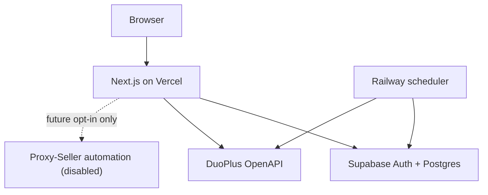
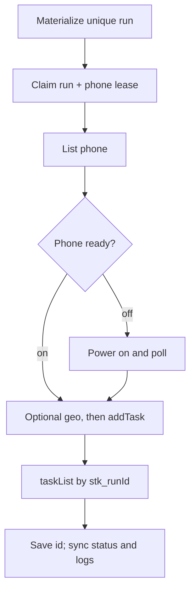

# Stakeout Ops architecture

Stakeout Ops is a multi-tenant scheduler for DuoPlus RPA tasks. The web application runs on Vercel, Supabase provides Auth and Postgres, and every workspace connects its own DuoPlus account. No platform-wide DuoPlus key exists.

## System boundary

The browser talks only to authenticated Stakeout Ops routes and to Supabase Auth. DuoPlus credentials, the Supabase secret key, the integration encryption key, and cron authentication are server-only. Production v1 has no Proxy-Seller dependency or required Proxy-Seller secret; the dotted boundary above is dormant future code. If explicitly enabled later, its key remains server-only and complete upstream URLs are never eligible for logs because the credential is embedded in the path. The scheduler uses the default Node.js runtime because credential encryption uses `node:crypto`.

## Tenant and authentication model

Supabase Auth is the identity provider. Server routes validate the current cookie-backed session with `auth.getUser()`. On a user's first authenticated request, `ensure_personal_workspace` creates a personal organization and an owner membership. This is the default path for friends using the deployment: each person signs in, receives an isolated workspace, saves their own DuoPlus API key, and imports only the phones and templates visible to that key.

`organization_members` is the authorization boundary. A request may select a workspace through `x-organization-id` or the `organizationId` query parameter, but the server accepts it only when the current user is a member. Owner and admin roles are required for connection-level changes. Collaborative organizations are supported by the data model; an invitation UI is outside the initial scope.

The server uses `SUPABASE_SECRET_KEY` for privileged work after it has checked membership. Because that key bypasses Row Level Security, every privileged route must carry the resolved `organizationId` into its queries. Browser access uses only the publishable key. RLS policies scope exposed business rows through `organization_members`; scheduler tables are read-only to the authenticated database role, and all mutations pass through authorized server routes. The encrypted credential columns have no grants for `anon` or `authenticated`.

## Data model

| Area | Tables | Purpose |
| --- | --- | --- |
| Tenancy | `organizations`, `organization_members` | Workspace identity, membership, and roles |
| Business | `clients` | Per-organization customer or campaign owner |
| DuoPlus | `duo_connections`, `duo_phones`, `duo_templates` | Encrypted BYO connection and discovered inventory |
| Coordination | `duo_rate_slots` | Cross-instance reservation for the 1.2-second API gap |
| Scheduler | `scheduler_schedules`, `scheduler_runs`, `cycle_programs`, `cycle_program_rules`, `device_cycles` | Calendar recurrence plus immutable relative-day cycle plans and idempotent occurrences |
| Profile readiness | `device_profiles`, `profile_score_events` | One profile lifecycle per device cycle, snapshotted score targets, per-app coverage, and one immutable score credit per successful run |
| Future proxy automation | `proxy_package_snapshots`, `proxy_lists`, `phone_proxy_bindings` | Reserved schema for dormant managed-proxy work; not populated or health-checked by production v1 |
| Execution | `scheduler_run_attempts`, `scheduler_run_events` | Attempts, leases, state history, and operator evidence |
| Audit | `duo_outbound_logs` | Redacted request/response metadata for every DuoPlus call |

The important ownership path is organization → connection → phone/template and organization → client → schedule → run. A schedule references inventory from the same organization. Runs persist the DuoPlus task id once it is reconciled, so later status sync and cancellation do not depend on an in-memory worker.

Device-cycle activation compiles every relative rule into the same scheduler execution path. A `window_once` rule creates one row whose eligibility spans both days, preventing the “day 10 or 11” work from becoming two tasks.

Each published cycle rule also snapshots an app category and fixed point value onto its generated runs. When a run first reaches `succeeded`, the database writes at most one immutable `profile_score_events` row for that run and recalculates profile totals. This database boundary makes retries and duplicate worker deliveries harmless. Ready and Completed are configurable program gates backed by score, successful-day, required-app, and required-special-task coverage; they are operational labels only and do not assert platform trust or ranking performance.

### Production v1 proxy boundary

Each device arrives with its dedicated proxy already configured and maintained outside Stakeout Ops. The default `preconfigured` path never creates a provider list, rotates or replaces credentials, attaches a different proxy in DuoPlus, verifies the exit IP, or runs a proxy health check. No Proxy-Seller key is required to launch or activate cycles.

Cycle country, region, city, and coordinates are operator-configured intent. The Command Center map plots that configured target location; it does not show observed proxy GEO and must not be presented as evidence that the exit IP matches the target.

The Proxy-Seller client, provisioning path, and reserved tables remain for a future managed mode. They stay dormant unless an operator deliberately sets `PROXY_SELLER_AUTOMATION_ENABLED=true` and also provides `PROXY_SELLER_API_KEY`. Supplying only a key or only the flag does not authorize provider calls.

Future implementation reference (disabled): the retained path matches an exact provider catalog country, region, and city, favors a less-used ISP within the client cohort, creates or reconciles a sticky list, and registers that connection in DuoPlus. Those are requested configuration values, not observed exit-network evidence; the dormant path does not turn them into a verified health or proximity claim.

Database RPCs are the concurrency boundary:

| RPC | Responsibility |
| --- | --- |
| `ensure_personal_workspace` | Idempotently bootstrap a new user's tenant |
| `materialize_schedule_runs` | Create unique future occurrences for a schedule |
| `reap_expired_run_leases` | Recover abandoned preparing work after its lease expires |
| `claim_due_runs` | Atomically lease runnable work to one worker |
| `acquire_phone_lease` | Prevent overlapping work on the same cloud phone |
| `reserve_duoplus_rate_slot` | Reserve the next outbound slot for a DuoPlus connection |
| `authorize_run_submission` | Fence `addTask` against a concurrent pause, remove, or lost lease |
| `disconnect_duoplus_connection` | Atomically refuse key removal while schedules or runs still depend on it |
| `renew_run_lease` | Extend ownership while a worker is still progressing |
| `release_run_lease` | Release or advance a run after an attempt |
| `prune_scheduler_history` | Delete old outbound logs and run events while preserving runs |
| `credit_profile_run` | Idempotently credit one successful, score-eligible cycle run and refresh its profile readiness state |
| `get_profile_app_scores` | Return organization-scoped earned/possible point totals by profile and app |

## BYO credential lifecycle

1. A workspace owner or admin submits a DuoPlus API key to an authenticated server route over TLS.
2. The server encrypts it with AES-256-GCM using a random 12-byte IV and the base64-decoded 32-byte `INTEGRATION_ENCRYPTION_KEY`.
3. Postgres stores `ciphertext`, `iv`, and `auth_tag`; the plaintext key is never returned to the browser.
4. A worker decrypts the key only in server memory immediately before an outbound call.
5. Request and response logs redact fields resembling keys, authorization, passwords, secrets, tokens, ciphertext, IVs, and authentication tags.

Changing `INTEGRATION_ENCRYPTION_KEY` without first re-encrypting every saved connection makes existing credentials unreadable. Treat key rotation as a data migration, not an environment-variable-only change. A DuoPlus HTTP or envelope code `401` is permanent credential failure; do not retry it as a transient error.

## DuoPlus protocol and rate control

All calls use `POST`, a JSON body, `Content-Type: application/json`, `Lang: en`, and the server-only `DuoPlus-API-Key` header. The default base URL is `https://openapi.duoplus.net`. An envelope with `code === 200` is successful, independent of the HTTP status. The client treats `401` as non-retryable and network, `429`, and server failures as retryable.

DuoPlus's minute-precision `issue_at` value has no offset. Each connection therefore has an explicit `issue_timezone`; the adapter defaults it to UTC. Deployment is blocked until the two-minute manual probe confirms how that DuoPlus account interprets the field. This serialization timezone is independent from the IANA timezone used to evaluate a schedule's cron expression.

DuoPlus allows one request per second. Production reserves calls in Postgres with `reserve_duoplus_rate_slot`, keyed by `duo_connections.id`, and waits at least `DUOPLUS_MIN_GAP_MS` (default `1200`) between starts. This remains correct when Vercel runs several function instances for one connection. Each workspace must use its own DuoPlus account; deliberately reusing one API key across workspaces would create independent local gates for the same upstream account. The in-memory allocator is only suitable for tests and single-process scripts.

Each call writes a best-effort row to `duo_outbound_logs`. Failure to write the audit row must not repeat an already-issued external request.

Inventory replacement is fail-closed. Phones and both template catalogs are fully paginated before database writes begin. A repeated page, inconsistent total, early short page, or safety-cap overflow aborts the sync and preserves the prior inventory. A completed fetch atomically re-enables seen official/custom templates and disables missing rows only within the same organization, connection, and source. Stakeout Ops does not use DuoPlus loop plans; `cycle_programs` and scheduler runs remain the recurrence source of truth.

The server client exposes this scheduler-facing surface:

| Capability | DuoPlus endpoint | Notes |
| --- | --- | --- |
| Phones and groups | `/api/v1/cloudPhone/list`, `/api/v1/cloudPhone/groupList` | `id` becomes `duoplus_image_id`; never copy ids between tenants |
| Subscription Startup | `/api/v1/subscriptionStartup/list` | Requested for both `free_status` pools; only non-expired records count toward the hard phone ceiling |
| Custom and official templates | `/api/v1/automation/userTemplateList`, `/api/v1/automation/officialTemplateList` | Fetch complete 100-item pages; persist id plus template type (`2` custom, `1` official) |
| Power | `/api/v1/cloudPhone/powerOn`, `/api/v1/cloudPhone/powerOff` | Body is `{ "image_ids": [...] }` |
| GPS and locale | `/api/v1/cloudPhone/update` | GPS type `1` lets DuoPlus derive GPS from the phone's already configured proxy; Stakeout Ops does not observe or verify that exit IP. Type `2` uses configured coordinates |
| Create task | `/api/v1/automation/addTask` | May acknowledge without returning a task id |
| List and evidence | `/api/v1/automation/taskList`, `/api/v1/automation/taskLogList` | Task listing always includes an issue-time window |
| Move waiting task | `/api/v1/automation/updateTaskTime` | Valid for waiting tasks only |
| Cancel or replay | `/api/v1/automation/setTaskStatus` | Status `5` cancels; status `0` re-runs an eligible task |
| Failure UI dump | `/api/v1/cloudPhone/command` | Best-effort `uiautomator dump /dev/tty` after a final RPA failure; bounded/redacted diagnostic evidence only |

## Dispatch and reconciliation

Dispatch follows these rules:

1. Materialization is idempotent. Only one `scheduler_runs` row may represent a schedule occurrence.
2. Claim the run and its phone through database leases. The acquisition locks the connection row and counts on, powering-on, and leased phones before reserving an off phone. If the exact Subscription Startup capacity has not been synced or every slot is occupied, a new power-on is deferred; existing DuoPlus tasks remain monitorable and cancellable. Workers may retry expired leases; they must not depend on process memory.
3. Refresh the selected phone with `/api/v1/cloudPhone/list`. Status `3` (expired) and `4` (renewal overdue) fail before task creation. Status `2` powers on through `/api/v1/cloudPhone/powerOn`. A horizon worker may poll until status `1`, capped at about 60 seconds; a minute worker defers the run so a later tick rechecks it. Statuses `0`, `12`, or a power-on timeout require operator attention.
4. If location targeting is enabled, update GPS and locale through `/api/v1/cloudPhone/update` before creating the task.
5. Create a task through `/api/v1/automation/addTask` with a deterministic name such as `stk_<run-id>`. DuoPlus may return only `{ "message": "success" }`, so a successful create does not prove a task id.
6. Reconcile through `/api/v1/automation/taskList`, matching the exact deterministic name inside an `issue_at` window of ±10 minutes. Persist the discovered id. A short phone lease covers power, configuration, and submission; the run's planned-window exclusion prevents two non-cancelled runs from occupying the same phone window.

Phone power ownership is explicit and fail-closed. An off phone first records a
scheduler power request, then becomes scheduler-owned only after the worker
observes it online. Each released run lease updates its last scheduler activity.
The minute tick may claim a confirmed scheduler-owned phone after 15 idle
minutes only when it has no active or near-term run. The claim blocks concurrent
assignment, fresh DuoPlus state is checked, and ownership is consumed before
`powerOff`; a phone that was already on is never marked and cannot enter this
shutdown path. Successful shutdown invalidates the cached Subscription Startup
snapshot so the next tick refreshes capacity before another power-on.
7. Reclaim each open run when `next_action_at` is due and repeat the exact-name `taskList` lookup in its ±10-minute window. On status `3` or `4`, fetch `/api/v1/automation/taskLogList` and retain a bounded evidence summary: opaque node IDs, allowlisted action names, booleans, timestamps, successful/failed/unknown action totals, generic error markers, and safe `result_info.extra_data.screenshot` URLs. User-defined node names, raw errors, and nested email, content, selector, credential, saved-variable, and network-request payloads are never persisted. Action telemetry awards zero points; profile scoring still credits only the configured rule once after the run succeeds.

DuoPlus task states are `0` waiting, `1` running, `2` paused, `3` done, `4` failed, and `5` cancelled. Cancellation uses `/api/v1/automation/setTaskStatus` with `status: 5`; it is valid only before a task is done or failed. The response can split ids into `success`, `fail`, and `fail_reason`, so cancellation is not all-or-nothing.

## Scheduler trigger profile

The persistent Railway process calls `runSchedulerTick` directly. It uses the same occurrence uniqueness, atomic claims, shared capacity pool, and phone leases as authenticated manual ticks.

| Mode | Trigger | Horizon | Responsibility |
| --- | --- | --- | --- |
| Minute | Sequential loop targeting 30 seconds | 15 minutes by default | Dispatch and status reconciliation in batches of 20 |
| Horizon | Startup and first iteration after 05:00 UTC | 26 hours | Larger batch of 100 and history pruning |

The loop waits for each tick before starting another. Transient database failures use bounded backoff. SIGTERM stops new ticks; database leases and remote task correlation support recovery if a deployment interrupts an in-flight tick. Repository objects are recreated per tick so their per-run caches do not grow for the lifetime of the process.

`/health` reports aggregate progress. Readiness requires a successful tick and expires on stale progress or repeated failures. A stall watchdog exits to trigger Railway's restart policy. Individual task failures remain in the run history. Readiness is not evidence of successful device execution.

The Vercel cron list is empty. `/api/cron/tick` remains an authenticated manual operational endpoint. Do not add another recurring controller against the same database. Deployment handovers use the database as the concurrency boundary.

See [Railway worker](railway-worker.md) for configuration. Device startup/shutdown time and actual subscription capacity still determine achievable fleet throughput.

## Deliberate v1 exclusions

- DuoPlus loop-plan creation and mutation (`addPlan`, `savePlan`, `setPlanStatus`, and `deletePlan`); `cycle_programs` and `scheduler_schedules` own cadence, pause, removal, history, and readiness scoring in one durable calendar.
- DuoPlus purchases, renewal, sharing, live view, and scanning.
- Proxy creation, rotation, replacement, verification, and health checks. The retained Proxy-Seller path is disabled future work, not part of production v1.
- Claims about observed exit proximity. The configured target marker is planning data, not observed proxy GEO.
- Official TikTok templates as a product workflow, although official template discovery exists in the client.
- General ADB orchestration. RPA is the supported execution path; the only v1 command fallback is a fixed, read-only UI hierarchy dump after a final RPA failure.
- Rank tracking and claims about search performance. Profile readiness measures completed scheduled activity only.

## Operational invariants

- Never place a DuoPlus key, future Proxy-Seller key, `SUPABASE_SECRET_KEY`, `INTEGRATION_ENCRYPTION_KEY`, or `CRON_SECRET` in a `NEXT_PUBLIC_` variable.
- Keep `PROXY_SELLER_AUTOMATION_ENABLED` unset or `false` and omit `PROXY_SELLER_API_KEY` in production v1. Any future managed mode requires both values deliberately.
- If future Proxy-Seller automation is enabled, never log a complete provider request URL; its credential is part of the path.
- Never lower `DUOPLUS_MIN_GAP_MS` below `1200` without a confirmed DuoPlus limit change.
- Never reuse one DuoPlus account key across multiple Stakeout workspaces unless rate reservations are first coordinated by an account fingerprint.
- Never create a DuoPlus task for an expired or renewal-overdue phone.
- Never interpret an `addTask` success message as a task id; reconcile by deterministic name.
- Never use a process-local lock for production rate limiting or run claiming.
- Keep RLS enabled on every exposed application table, even when most writes use the server client.
